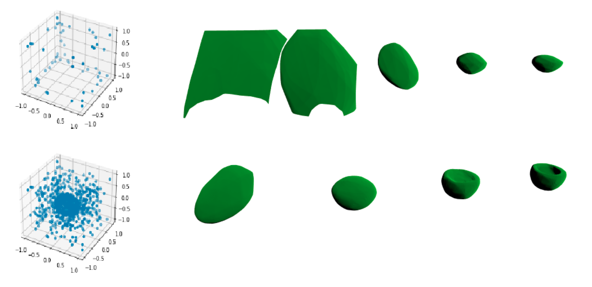
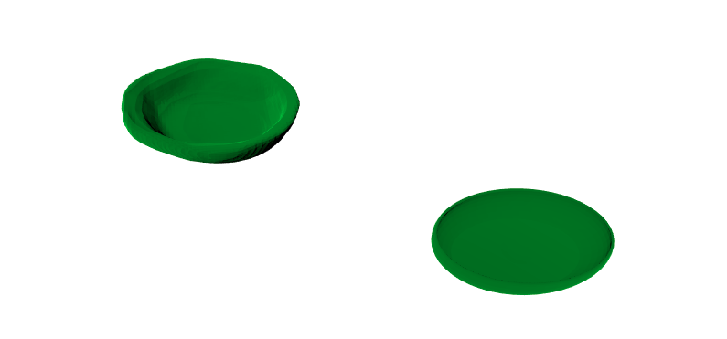

# NeoRender_test_task



## Short description
This repository contains code I wrote for better understanding of 3D reconstruction using Deep Learning and SDFs.
During my research I found several papers directly related to the problem. Almost all of them cited CVPR '19 paper 
["DeepSDF: Learning Continuous Signed Distance Functions for Shape Representation"](https://openaccess.thecvf.com/content_CVPR_2019/papers/Park_DeepSDF_Learning_Continuous_Signed_Distance_Functions_for_Shape_Representation_CVPR_2019_paper.pdf). This paper looks like to be the
first that used deep learning for predicting SDFs. Therefore I spent much of my efforts on understanding and writing
code that could recreate the idea exposed in the paper. I did it despite the fact that some newer [solutions](https://github.com/ErlerPhilipp/points2surf)
proposed pretrained models that may give expressive representations without any effort. Though this may be used for
comparison of predicted shapes' quality.

## Repository organization
Right now this repository contains four folders and a couple scripts. 

`data` directory is created for containment of 3D object's datasets and calculated SDFs.

`training` directory contains logs from training: intermediate weights of models along with losses  and optimizers.

`source` directory contains all useful classes I implemented during my small investigation.

`notebooks` directory contains experiments along with visualization. At the moment it has three notebooks: 
  1. sampling visualization - [sampling_visualization.ipynb](notebooks/sampling_visualization.ipynb).
  2. vizualization of very light DeepSDF network with size of latent vectors 16 - [very_narrow_net_reconstruction.ipynb](notebooks/very_narrow_net_reconstruction.ipynb)
  3. vizualization of light DeepSDF network with size of latent vectors 32 - [narrow_net_reconstruction.ipynb](notebooks/narrow_net_reconstruction.ipynb)
  
Run notebooks after loading datasets, because they rely on specific data.

Script `load_data.py` downloads classes that are listed in the `classes.json`. File `classes.json` in its turn has codes of class from 
[ShapeNetCore.v2](http://shapenet.cs.stanford.edu/shapenet/obj-zip/ShapeNetCore.v2/) dataset. You can find correspondence between codes 
and class normal names in ['shapenet_classes_list.txt'](shapenet_classes_list.txt). Right now this script only maintains classes from 
ShapeNetCore.v2. Other datasets like ABC are not available yet.

Script `sample_points.py` samples points near the surface of all objects it can find in the `data/ShapeNetCoreV2` directory. 

Script `train.py` trains the model using preprocessed data from `data\SDFs` folder. Specifications for the network are listed in `specs.json`.

## Implemented classes

[MeshSampler](source/mesh_sampler.py) - class that samples points and calculates SDFs. This is my implementation of the С++ code from here:
https://github.com/facebookresearch/DeepSDF/blob/master/src/PreprocessMesh.cpp. All the defaults were taken 
from that implementation as well. I implemented it in Python by means of trimesh library. Unfortunately due to the usage of rtrees for 
saving vertices this approach may lead to consumption of all the memory and unauthorized halting. 
See [issue](https://github.com/mikedh/trimesh/issues/976) I opened on this topic.

[Decoder](source/deep_sdf.py) - implementation of the DeepSDF neural network.

[LearningRateSchedule](source/learning_rate.py) - implementation of learning rate decay.

[SDFSamples](source/sdf_samples.py) - implements dataset of sampled points with SDF. Each data sample represents a set of points for a single object.
Reads and returns points on demand.

[DeepSDFTrainer](source/deep_sdf_trainer.py) - class that implements the training process of the network. 

[DeepSDFReconstructor](source/deep_sdf_reconstructor.py) - class that implements reconstruction of the latent vector for given set of sampled points.

## Usage

This project was developed under Ubuntu 20.04 system. As an environment manager I used Anaconda3. 
All the required packages you can find in [`requirements.txt`](requirements.txt).

Check you have installed `lftp`. I used it for transfering dataset.

```
$ sudo apt-get update
$ sudo apt-get install lftp
```

Now load ShapeNetCore.v2 class listed in `classes.json`:
```
$ python load_data_sets.py  
```

Sample points along with SDFs:
```
$ python sample_points.py
```
This may be a rather time consuming routine.

And last one. Start training:
```
$ python train.py
```

## TODO
Right now I have tested light neural networks. More sophisticated models and tests are yet to be created.

## Interesting papers I found:

### DeepSDF
https://openaccess.thecvf.com/content_CVPR_2019/papers/Park_DeepSDF_Learning_Continuous_Signed_Distance_Functions_for_Shape_Representation_CVPR_2019_paper.pdf

### Deep Local Shapes
https://arxiv.org/pdf/2003.10983.pdf

### Points2Surf: Learning Implicit Surfaces from Point Clouds (ECCV 2020 Spotlight)
https://arxiv.org/pdf/2007.10453.pdf

### AtlasNet
https://arxiv.org/pdf/1802.05384.pdf

